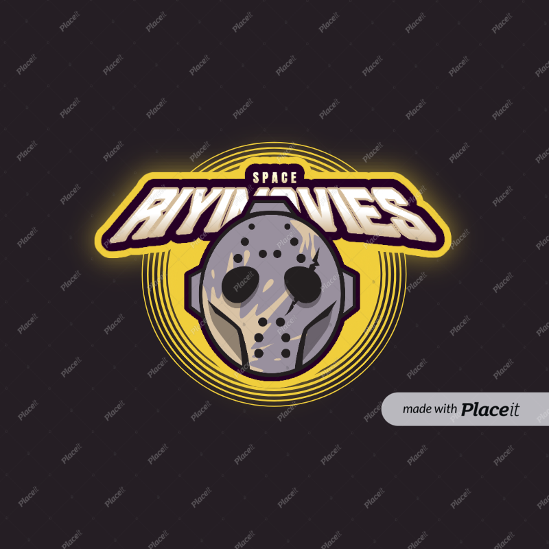

Movies

<a name="Richard Sikaonga"></a>

<div  align="center">

<br/>
  <h3><b>Best Tv Shows and movies</b></h3>
</div>

# 📗 Table of Contents

- [📗 Table of Contents](#-table-of-contents)
- [📖 \[RIYIMOVIE CHANNEL\] ](#-riyimovie-channel-)
  - [🛠 Built With ](#-built-with-)
    - [Tech Stack ](#tech-stack-)
    - [Key Features ](#key-features-)
  - [📹 Video Presentation ](#-video-presentation-)
  - [💻 Getting Started ](#-getting-started-)
    - [Prerequisites](#prerequisites)
    - [Setup](#setup)
    - [Usage](#usage)
    - [Run tests](#run-tests)
    - [Deployment](#deployment)
  - [👥 Authors ](#-authors-)
  - [🔭 Future Features ](#-future-features-)
  - [🤝 Contributing ](#-contributing-)
  - [⭐️ Show your support ](#️-show-your-support-)
  - [🙏 Acknowledgments ](#-acknowledgments-)
  - [📝 License ](#-license-)
<!-- PROJECT DESCRIPTION -->

# 📖 [RIYIMOVIE CHANNEL] <a name="about-project"></a>

This is the web application app that will help other developer get motivated on creating the API apps and movie sites.
Its Mobile vision app and can be accessed on the Mobile devices and Desktop

**[Mobile portfolio app]** is a Mobile vision app that makes easier for Developers to chocase there projects
so that other developer's can find them or see what the have built.

## 🛠 Built With <a name="built-with"></a>

- [x] HTML
- [x] CSS
- [x] ES6
- [x] Webpack
- [x] External APIs
### Tech Stack <a name="tech-stack"></a>
<details>
  <summary>Client</summary>
  <ul>
    <li><a href="https://developer.mozilla.org/en-US/docs/Web/HTML">HTML</a></li>
    <li><a href="https://developer.mozilla.org/en-US/docs/Web/CSS">CSS</a></li>
    <li><a href="https://www.javascript.com/">ES6</a></li>
    <li><a href="https://webpack.js.org/">Webpack</a></li>
    <li><a href="https://www.themealdb.com/api.php">Tvmaz API</a></li>
  </ul>
</details>
### Key Features <a name="key-features"></a>

- **[Display all movies from the Tvmaz API.]**
- **[Show the number of episodes in the website.]**
- **[Like a movie.]**
- **[Show the number of likes on a espisode.]**
- **[Leave user comments on a movie.]**
- - **[Display the number of Tvshows]**


<p align="right">(<a href="#readme-top">back to top</a>)</p>

<!-- ## 🚀 Live Demo <a name="live-demo"></a> -->
-[Demo here](https://capstone-2-e2t7.onrender.com)

## 📹 Video Presentation <a name="video-presentation"></a>

- [Video Presentation](https://www.loom.com/share/8489447b36fb4be0ae7e317ae1e9e78e?sid=bed2b077-e524-453d-b1cf-44b2b071142f)

<p align="right">(<a href="#readme-top">back to top</a>)</p>

## 💻 Getting Started <a name="getting-started"></a>

To all the new developers this project will give you an idea how to start building your mobile vision apps
To get a local copy up and running, follow these steps.
follow me on my github account at richie1988 then clone or fork the repository called mobile-portfoliofinish

### Prerequisites

In order to run this project you need:
desktop-computer/laptop
any text editor installed inside

### Setup
Clone this repository to your desired folder:
```sh
cd my-folder
Clone this repository to your desired folder:
run:
git clone (https://github.com/richie1988/KanbanCapstone)

### Install
Install the prerequisites this project using:
```sh
cd Restaurant-System
```
```bash
npm start
```

### Usage
To run the project:
```bash
npm install
```
### Run tests
To run tests after setting up the linters, run the following command:
```sh
npx hint .
```
```sh
npx stylelint "**/*.{css,scss}"
```
```bash
npx eslint .
```
### Deployment

You can deploy this project using:
.Vscode
.github
.git
.any text editor

<p align="right">(<a href="#readme-top">back to top</a>)</p>

## 👥 Authors <a name="Richard Sikaonga"></a>

I would like Thank Microverse Team and my Collabaration partners whom they have paired me for the entire project the contributed there knowledge and ideas towards the Contact form part for this projects.

👤 **Author**
 **Richard Sikaonga**
- GitHub: [@githubhandle](https://github.com/richie1988)
- Twitter: [@twitterhandle](@Richiesikaonga)
- LinkedIn: [LinkedIn](in/richard-sikaonga-039940275)

👤 **Author2**
 **Ismail Halliru Muhammad**
- GitHub: [@githubhandle](https://github.com/ismailhallirumuhammad)
- Twitter: [@twitterhandle](https://mobile.twitter.com/IsmailhalliruM1)
- LinkedIn: [LinkedIn](https://www.linkedin.com/mwlite/in/ismail-halliru-muhammad-2a8453127)

<p align="right">(<a href="#readme-top">back to top</a>)</p>

## 🔭 Future Features <a name="future-features"></a>

- **[Consumption of more APIs]**
- **[More dynamic styling]**
- **[Improved UX interaction]**

<p align="right">(<a href="#readme-top">back to top</a>)</p>

## 🤝 Contributing <a name="contributing"></a>

Contributions, issues, and feature requests are welcome!

Feel free to check the [issues page](https://github.com/yayaismaail/capstone-2/issues).

<p align="right">(<a href="#readme-top">back to top</a>)</p>

## ⭐️ Show your support <a name="support"></a>

Give a like if you like this project and kindly follow us using our social media handles
If you like this project please feel free to reach me on social media platform and contact me ready to face new world challenges and takle them kindly show your support by reaching me and giving me the opportunity i need.

<p align="right">(<a href="#readme-top">back to top</a>)</p>

## 🙏 Acknowledgments <a name="acknowledgements"></a>

I would like to thank the Microverse Team and the founder of Microverse for the opportunity is giving the young and old developer to merg through the world of opportunity.

<p align="right">(<a href="#readme-top">back to top</a>)</p>

## 📝 License <a name="license"></a>

This project is [MIT](./MIT.md) licensed.
<p align="right">(<a href="#readme-top">back to top</a>)</p>
